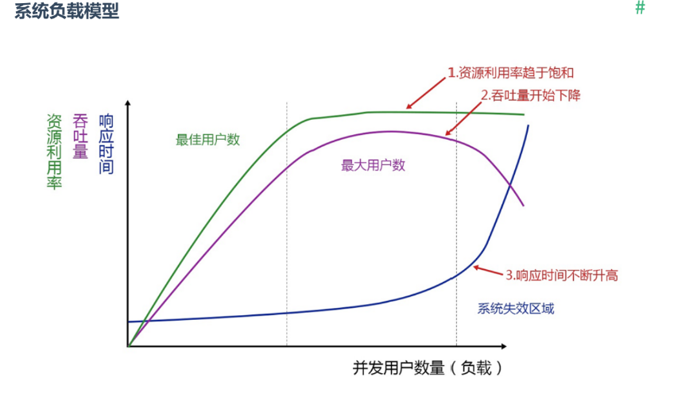
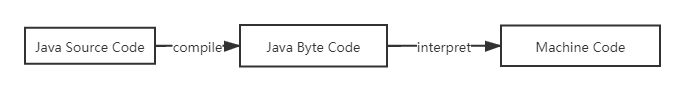

# Jmeter(1) - 性能测试概念与JVM补充

## 性能测试概念

### 性能测试的目的

性能测试本身不是为了发现软件bug而进行的测试活动，更关注的是在**不同负载**下，系统的表现，是为了发现系统的性能瓶颈而进行的测试活动，一般情况下，性能测试最终要实现的目标往往有：

1. 获取系统性能指标，作为性能指标的基准（指在第一个版本上进行的性能测试）
2. 验证系统的性能指标是否达到要求
3. 发现系统的性能瓶颈、内存泄漏等问题
4. 帮助系统运维部门更好地规划硬件配置
5. 帮助系统稳定性的确认与实时

### 需要提取的性能指标

在具体的实施中，以常见的Web接口性能测试为例，包含一些常见性能指标：

1. 并发用户数：同时对服务器产生请求的用户总数
2. 响应时间：
    - 响用户体验的参数
    - 主要关注服务器响应时间
    - 以带js的请求为例，响应时间组成往往包含：发送请求+处理请求（应用处理时间+数据库处理时间）+响应时间+浏览器解析时间+重新发送请求时间+处理请求（应用处理时间+数据库处理时间）+响应时间+浏览器渲染时
3. 吞吐量：描述系统的处理能力（单位时间处理的事务）
4. 资源利用率：服务器CPU，内存，IO等资源的占用情况
5. 最佳用户数：指系统能承受的最佳负载
6. 最大用户数：系统能承受的最大负载，超过则可能响应慢或宕机
7. 事务处理能力(和吞吐量相同，只是部分报告中会将吞吐和事务吞吐单独分开)：单位为tps，transaction per second

### 性能测试的本质

在一般的性能测试中，往往是基于接口的测试，用户负载一般认为，是多个用户在同时间进行了操作，单用户操作时本质上也是在进行接口调用，所以性能测试本质上就是使用**接口协议**和**多线程**实现，同时在线程规划和接口选择上尽可能模拟真实场景

### 理想性能负载模型图

图形特点：
 - 响应时间：总趋势随着并发用户数上升而上升，在超过最大用户数之前，增速较低；在超过最大用户数后，响应时间增速增大，此时服务器往往已经无法正常响应请求甚至宕机，队列会很长
 - 吞吐量：在最佳用户数之前，吞吐量随并发数上升而上升，而且近似线性；在超过最大用户数之前出现峰值，超过最大用户数之后，会开始下降，且随着用户数进一步增加下降速度会增大；此时服务器已经实际上无法处理请求
 - 资源利用率：随着并发用户数增加而增加，在达到100%后会开始满载运行，新的请求只能进入队列

### 性能测试中的相关名词概念

1. 用户数相关概念
   - 系统用户数：期望值(系统最初规划的目标用户数)
   - 在线用户数：当前保持连接状态的用户数
   - 并发用户数：同时对系统发送请求的用户数
   - 注册用户数：系统中注册的用户数
2. 性能测试的类型
   - 负载测试：测试一定条件下的最大用户数；与设计进行对比
   - 压力测试：一定条件下，长时间使用最佳用户数运行，主要针对稳定性；至少要24h，一般为36或48h；找到系统失效以及失效的反应
   - 容量测试：一定环境下，数据库处理大量数据的性能表现(使用的接口都是对数据库高负载的接口)
   - 配置测试：不同环境下系统的性能表现，主要为选择设备和参数进行配置
   - 基准测试: 第一个版本的测试，一般用单用户跑
   - 并发测试：有的地方可能会这么叫，但是实际上上述测试本身肯定涉及了字面意义的并发测试
3. 性能测试的执行流程
   1. 设计：需求分析，方案设计
   2. 实现：场景设计，脚本开发，脚本优化
   3. 执行：搭建环境，运行脚本，收集测试数据
   4. 分析：分析性能指标，发现瓶颈，系统调优

## JVM相关

### 概念

JVM全称Java Virtual Machine，是一个抽象出的虚拟机器，本质上完成的核心工作就是将java自己的bytecode格式转换为系统可以识别的机器码，本质上经历了如下的过程：

byte code与machine code：

| byte code                                           | machine code                           |
| --------------------------------------------------- | -------------------------------------- |
| 中间代码                                        | 最终机器执行的代码            |
| 包含了很多机器无法直接理解的数据，一般只能供jvm使用 | 只包含二进制码，机器可以直接读取和使用 |
| 由jvm执行                                        | 由CPU执行                           |
| 脱离底层硬件，任何一个有对应jvm的设备都可以运行 | 与硬件有关，可能换个硬件就无法执行了 |

在java程序运行过程中，jvm类似于一个实时的运行中的工作环境，java代码中的main函数，其实本质上是由jvm调用的，一般jre中都包含着jvm；在程序运行过程中，JVM一般会进行